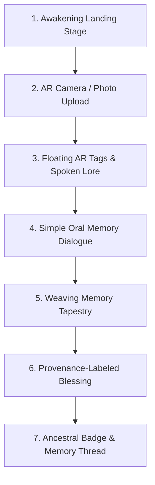

# 🕊️ The Ancestor's Test — Roots Edition (AR)

> **A cinematic, AI-powered living heritage storytelling experience that awakens family heirlooms through AR lens vision, oral dialogue, ethnographic craft provenance, and warm humanized multilingual voice synthesis.**

[](https://nextjs.org/)
[](https://www.typescriptlang.org/)
[](https://tailwindcss.com/)
[](https://github.com/oframe/ogl)
[](https://groq.com/)

---

## 🌌 Overview

**The Ancestor's Test** bridges ancestral memory and cutting-edge web technology. Point your camera at any family heirloom, historic keepsake, or cherished object to awaken the Ancestor. Through screen-space AR tags, authentic craft history, and simple conversational dialogue, the Ancestor listens to your family memories and synthesizes a permanent **Provenance-Labeled Blessing** certified with verifiable regional lineage.

---

## 🎨 Design & Visual Aesthetic

- **🌸 React Bits `<SoftAurora />` WebGL Shader**: GPU-accelerated Perlin noise aurora curtains in luminous mist (`#f7f7f7`) and radiant magenta/purple (`#e100ff`) with interactive mouse physics.
- **✨ Cosmic Obsidian Glassmorphism**: Deep space backdrop (`#0A0612`), floating particle sparkles, frosted magenta borders, and liquid crystal text gradients.
- **⚡ 60 FPS Performance**: Optimized half-resolution offscreen rendering, lightweight particle engine, and hardware-accelerated animations.

---

## 👁️ Intelligent Dynamic Visual Recognition

The visual vision engine identifies a diverse spectrum of ancestral objects with tailored craft observations, material compositions, historical eras, and AR coordinate tags:

| Category | Object Recognized | Materials & Craft Observations |
|:---|:---|:---|
| 📚 **Books & Journals** | *Handwritten Leather-Bound Ancestral Book & Journal* | Vegetable-tanned leather, cotton rag parchment, iron gall calligraphy, hand-stitched archival spine. |
| 🚗 **Vintage Automobiles** | *1920s Classic Model T Vintage Automobile* | Pressed steel body, artillery wooden spoke wheels, black enamel cowl, folding canvas convertible hood. |
| 🕰️ **Timepieces** | *1924 Victorian Brass Pocket Watch* | Hand-engraved brass filigree bezel, Swiss mechanical movement, fluted winding crown, oxidized patina. |
| 📷 **Vintage Cameras** | *1954 Classic Rangefinder Camera* | Satin chrome chassis, vulcanite leatherette grip, coated optical lens, machined mechanical shutter dial. |
| 🪔 **Sacred Brassware** | *Hand-Cast Brass Diya Pooja Lamp* | Lost-wax cast bell metal, Mayura peacock crest, five-wick cardinal basin, sacred ceremonial smoke patina. |
| 🧣 **Handwoven Textiles** | *Handwoven Crimson Silk Ikat Shawl* | Pure mulberry silk, double-ikat resist-dyeing, organic madder hue, hand-knotted gold zari fringes. |
| 📿 **Ancestral Jewelry** | *Ancestral Gold Filigree Jhumka Earrings* | 22K hand-beaten gold, royal Kundan stone setting, delicate wire floral rosettes, natural seed pearl drops. |
| 📦 **Heritage Kitchen Relics** | *Carved Rosewood Masala Dabba* | Solid dark rosewood, hand-chiseled lotus relief, aromatic spice oil patina, seven nested hammered brass cups. |
| 🏍️ **Classic Motorcycles** | *Vintage 1950s Classic Motorcycle* | Polished chrome teardrop tank, cast iron cooling fins, sprung leather solo saddle with road-worn patina. |
| 🎻 **Classical Instruments** | *Hand-Carved Saraswati Veena* | Matured jackwood, sacred dragon Yali headstock, 24 brass frets on hardened beeswax, bronze resonance strings. |

---

## 🎙️ Multilingual Warm Maternal Voice (TTS & STT)

- **Warm Female Voice**: Specially tuned pitch (1.04) and gentle, comforting maternal cadence (0.88) with real-time soundwave equalizer bars.
- **14+ Regional & Global Languages**: Full Speech-to-Text (STT) and Text-to-Speech (TTS) support for:
  - 🇮🇳 Hindi, Tamil, Telugu, Bengali, Marathi, Gujarati, Kannada, Malayalam, Punjabi
  - 🌍 English, Spanish, French, Arabic, Japanese

---

## 🏛️ The 7-Stage Interactive Pipeline



1. **Awakening**: Ethereal `<SoftAurora />` welcome with liquid text and sample heirloom selector.
2. **AR Camera & Lens**: Live camera stream, category selector pill bar (`📚 Book`, `🚗 Car`, `🕰️ Watch`, etc.), photo upload, and laser reticle HUD.
3. **Floating AR Tags**: Screen-space coordinate tags, editable heirloom title, 1-click category switcher, and spoken lore narration.
4. **Oral Dialogue**: 3 short, natural, humanized conversational questions answering via live voice input or keyboard.
5. **Weaving Tapestry**: Step-by-step memory token extraction and ethnographic archival lookup with live progress checkmarks.
6. **Provenance Blessing**: Sacred 3-tier blessing weaving Personal Memory, Archival Roots, and the Ancestor's Lyrical Telling.
7. **Ancestral Badge**: Unlockable glowing digital medallion and multi-generational session archive.

---

## 🛠️ Tech Stack & Architecture

- **Frontend**: [Next.js 14](https://nextjs.org/) (App Router, TypeScript, React 18)
- **Styling**: [Tailwind CSS](https://tailwindcss.com/) + Custom Glassmorphism & Neon Tokens
- **Shaders & 3D**: `ogl` (WebGL 3D Procedural Perlin Noise Raymarching)
- **Animations**: [Framer Motion](https://www.framer.com/motion/) + Canvas Particle Engine + Canvas Confetti
- **Typography**: [Google Fonts](https://fonts.google.com/) (`Cinzel` & `Inter` via `next/font/google`)
- **Speech & Audio**: Web Speech API (`SpeechRecognition` + `SpeechSynthesis`)
- **AI Models**: Groq API (`llama-3.2-90b-vision-preview`, `llama-3.3-70b-versatile`) with built-in zero-downtime intelligent visual ontology.

---

## 🚀 Quick Start

### 1. Clone the repository
```bash
git clone https://github.com/nirashbelli64-glitch/Ancestor-Roots.git
cd Ancestor-Roots
```

### 2. Install dependencies
```bash
npm install
```

### 3. Configure Environment Variables (Optional)
Copy `.env.local.example` to `.env.local`:
```bash
cp .env.local.example .env.local
```
Add your Groq API key (optional — app includes full offline dynamic visual classification):
```env
GROQ_API_KEY=your_groq_api_key_here
```

### 4. Run Development Server
```bash
npm run dev
```
Open **[http://localhost:3000](http://localhost:3000)** in your browser.

### 5. Build for Production
```bash
npm run build
npm run start
```

---

## 📂 Project Structure

```
ancestors-test/
├── app/
│   ├── api/
│   │   ├── scan/route.ts         # Visual object & AR tag recognition
│   │   ├── questions/route.ts    # Tailored memory retrieval questions
│   │   ├── extract/route.ts      # Emotional resonance & keyword extraction
│   │   ├── roots/route.ts        # Archival craft & ethnographic context
│   │   └── blessing/route.ts     # Provenance blessing synthesis
│   ├── globals.css               # Cosmic obsidian & pink/purple glassmorphism
│   ├── layout.tsx                # next/font/google Cinzel/Inter font loader
│   └── page.tsx                  # Main 7-stage orchestrator
├── components/
│   ├── stages/                   # 7 interactive pipeline stages
│   │   ├── LandingStage.tsx      # Welcome stage with SoftAurora
│   │   ├── CameraStage.tsx       # Viewfinder, category pill selector, upload
│   │   ├── TagsStage.tsx         # AR tags, 1-click switcher, editable title
│   │   ├── QuestionStage.tsx     # Simple conversational dialogue (STT/TTS)
│   │   ├── ProcessingStage.tsx   # Weaving memory tapestry
│   │   ├── BlessingStage.tsx     # 3-tier provenance blessing
│   │   └── BadgeStage.tsx        # Unlockable ancestral badges
│   ├── ui/                       # UI components (SoftAurora, Particles, Voice)
│   │   ├── AncestorVoice.tsx     # Warm maternal female TTS player
│   │   ├── FloatingTag.tsx       # Screen-space AR beacon
│   │   ├── LanguageSelector.tsx  # 14+ language switcher
│   │   ├── ParticleCanvas.tsx    # 60fps lightweight ember canvas
│   │   ├── ScanReticle.tsx       # Neon HUD laser scanner
│   │   ├── SoftAurora.tsx        # WebGL Perlin noise shader (#f7f7f7, #e100ff)
│   │   └── VoiceInput.tsx        # Speech-to-Text microphone input
│   └── providers/
│       └── SessionContext.tsx    # Global session state & Memory Thread
└── lib/
    ├── groq.ts                   # Groq vision & chat completions with fallback
    ├── languages.ts              # 14+ language definitions & voice matching
    ├── prompts.ts                # Conversational system prompts
    ├── samples.ts                # Heirloom presets gallery
    ├── types.ts                  # TypeScript schema definitions
    └── visionClassifier.ts       # 10+ category visual ontology & pixel analyzer
```

---

## 📜 License
MIT © 2026 The Ancestor's Test Team
